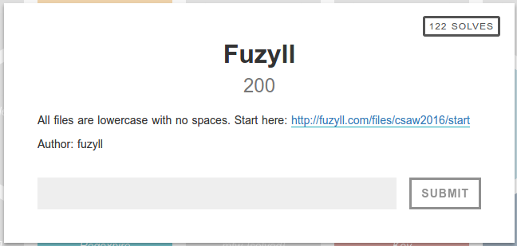
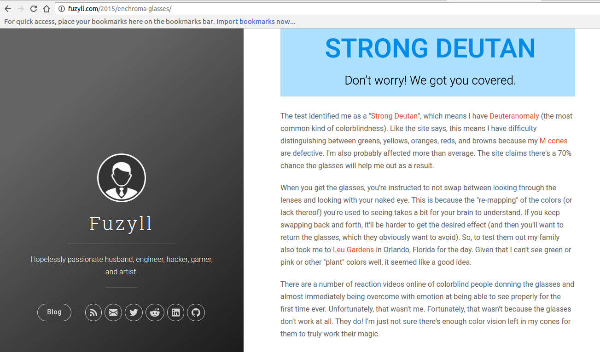
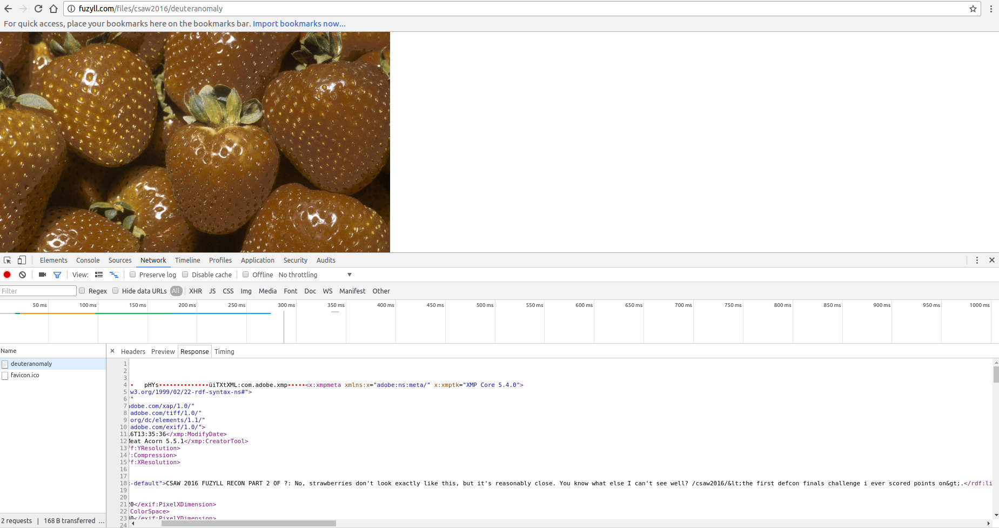
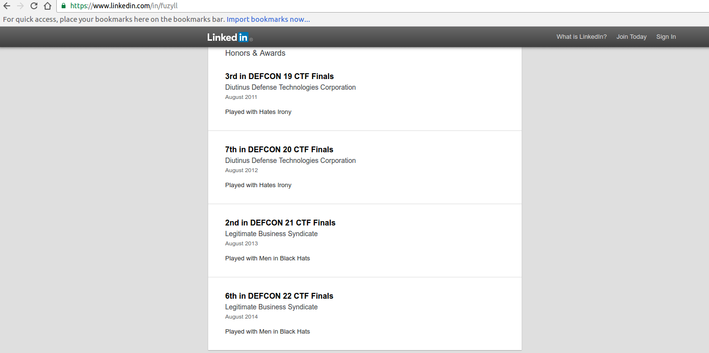
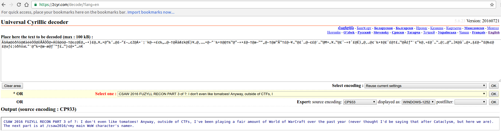
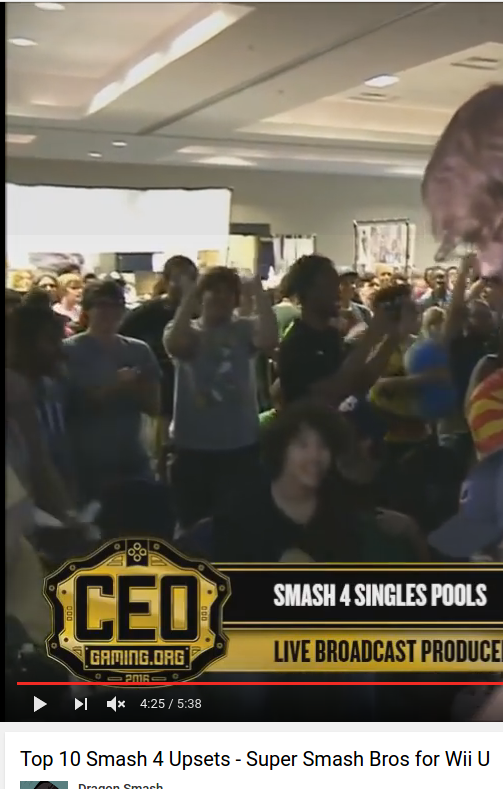
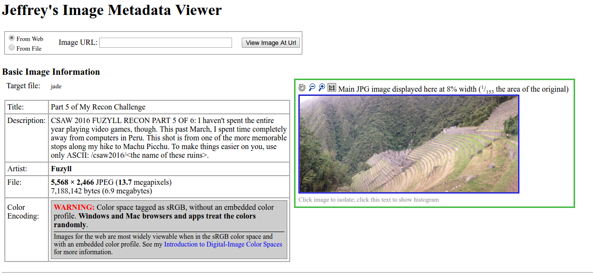

Stage 1: http://fuzyll.com/files/csaw2016/start
This site gives the hint:
CSAW 2016 FUZYLL RECON PART 1 OF ?: People actually liked last year's challenge, so CSAW made me do it again... Same format as last year, new stuff you need to look up. The next part is at /csaw2016/<the form of colorblindness I have>.

For this stage I googled "fuzyll color blind" and found fuzyll's blog where he says he has Deuteranomaly:

Stage 2: http://fuzyll.com/files/csaw2016/deuteranomaly

This page presents us with a picture of strawberries, looking at the exif data tells us the next stage.

Stage 3:
CSAW 2016 FUZYLL RECON PART 2 OF ?: No, strawberries don't look exactly like this, but it's reasonably close. You know what else I can't see well? /csaw2016/&lt;the first defcon finals challenge i ever scored points on

Googling "fuzyll linkedin" will find his linkedin page, which lists which defcons he has competed in.
The earliest on the list was defcon 19

To see if I could find which challenges he did, I googled "fuzyll defcon challenges" which brought me to a vm of defcon challenges he compiled:
http://fuzyll.com/2016/the-defcon-ctf-vm/

The github page has challenges sorted by year, after trying all the challenge names for defcon 19, I found that 'tomato' was the solution

Stage 4: http://fuzyll.com/files/csaw2016/tomato

This page presents us with the text:
ÃâÁæ@òðñö@ÆäéèÓÓ@ÙÅÃÖÕ@×ÁÙã@ó@–†@oz@É@„–•}£@…¥…•@“‰’…@£–”£–…¢Z@Á•¨¦¨k@–¤£¢‰„…@–†@ÃãÆ¢k@É}¥…@‚……•@—“¨‰•‡@@†‰™@”–¤•£@–†@æ–™“„@–†@恙ف†£@–¥…™@£ˆ…@—¢£@¨…™@M•…¥…™@£ˆ–¤‡ˆ£@É}„@‚…@¢¨‰•‡@£ˆ£@†£…™@Á£ƒ“¨¢”k@‚¤£@ˆ…™…@¦…@™…]K@㈅@•…§£@—™£@‰¢@£@aƒ¢¦òðñöaL”¨@”‰•@æ–æ@ƒˆ™ƒ£…™}¢@•”…nK

I assumed this was some sort of weird encoding, so I looked for encoding detectors online and found the "Universal Cyrillic decoder":

looking through all of their possible encodings revealed the solution.

Stage 5:
CSAW 2016 FUZYLL RECON PART 3 of ?: I don't even like tomatoes! Anyway, outside of CTFs, I've been playing a fair amount of World of WarCraft over the past year (never thought I'd be saying that after Cataclysm, but here we are). The next part is at /csaw2016/<my main WoW character's name>.

Googling "fuzyll world of warcraft" found this site on his blog:
http://fuzyll.com/2015/blackfathom-deep-dish/

I found this guild on the WoW armory, and sorted the roster by rank, the guild master is "elmrik", which is the solution to this stage.

Stage 6:
The page gives us some ruby code:
~~~
#!/usr/bin/env ruby

CHARS = ["0", "1", "2", "3", "4", "5", "6", "7", "8", "9", "B", "C", "D",
         "F", "G", "H", "J", "K", "L", "M", "N", "P", "Q", "R", "S", "T",
         "V", "W", "X", "Y", "Z", "b", "c", "d", "f", "g", "h", "j", "k",
         "l", "m", "n", "p", "q", "r", "s", "t", "v", "w", "x", "y", "z"]

def encode(string)
    input = string.bytes.inject {|x, y| (x << 8) + y }
    output = ""
    while input > 0
        output = CHARS[input % 52].to_s + output
        input /= 52
    end
    return output
end

def decode(input)
    # your implementation here
end

message = "JQSX2NBDykrDZ1ZHjb0BJt5RWFkcjHnsXvCQ4LL9H7zhRrvVZgLbm2gnXZq71Yr6T14tXNZwR1Dld2Y7M0nJsjgvhWdnhBll5B8w0VP3DFDjd3ZQBlcV4nkcFXBNzdPCSGMXQnQ7FTwcwbkG6RHX7kFHkpvgGDDGJvSDSTx7J6MFhRmTS2pJxZCtys4yw54RtK7nhyW6tnGmMs1f4pW6HzbCS1rSYNBk3PxzW9R1kJK54R2b7syLXd7x1Mr8GkMsg4bs3SGmj3rddVqDf4mTYq1G3yX1Rk9gJbj919Jw42zDtT2Jzz4gN0ZBmXPsBY9ktCLPdFrCPZ33NKJy5m37PK0GLXBxZz9k0cjzyt8x199jMsq7xrvNNgDNvgTbZ0xjZzHhkmrWrCmD7t4q4rWYFSJd4MZBxvnqc0VgGzdkq8jSJjnwcynq9VfH22WCQSdPKw48NkZL7QKGCT94pSb7ZSl2G6W37vBlW38q0hYDVcXTTDwr0l808nDPF6Ct1fPwKdNGKbRZ3Q3lHKMCYBC3w8l9VRjcHwMb1s5sMXM0xBvF8WnWn7JVZgPcXcwM2mDdfVkZsFzkrvVQmPfVNNdk9L5WtwDD8Wp9SDKLZBXY67QkVgW1HQ7PxnbkRdbnQJ4h7KFM2YnGksPvH4PgW2qcvmWcBz62xDT5R6FXJf49LPCKL8MQJLrxJpQb7jfDw0fTd00dX1KNvZsWmfYSTl1GxPlz1PvPSqMTQ036FxSmGb6k42vrzz2X90610Z"
puts decode(message)
~~~

The encode method keeps a running sum of each char, shifting the sum to the left 8 bits before each add.
the sum is then looped over, creating a string from the CHARS array

My script to decode it:
~~~
def decode(input)
    index = 0
    output = CHARS.index(input[0])

    while index < input.length
        char = input[index]
        output *= 52
        output += CHARS.index(input[index])
        index += 1
    end

    index = 0
    final = ""
    while true
        final = ((output >> 8 * index) & 0xFF).chr + final
        output -= (output >> 8 * index) & 0xFF
        if (output >> (8 *index)) <= 0
            return final
        end
        index += 1
    end
    return final
    # your implementation here
end
~~~

This doesn't work completely, but it works well enough to get to the next stage.

Stage 7:
On stream, after one of these big upsets in Smash 4, you can see me in the crowd with a shirt displaying my main character! The next part is at /csaw2016/<the winning player's tag>.

I googled "Biggest smash 4 upsets" and found a video, and just tried the tags of all the players in it, the answer is jade

Stage 8: http://fuzyll.com/files/csaw2016/jade
This page sends you a file called "jade".
Running 'file' on it says that it's gzipped, gunzipping it gives you an image.
Checking the exif data on the image brings you to the next stage.

Stage 9:
CSAW 2016 FUZYLL RECON PART 5 OF 6: I haven't spent the entire year playing video games, though. This past March, I spent time completely away from computers in Peru. This shot is from one of the more memorable stops along my hike to Machu Picchu. To make things easier on you, use only ASCII: /csaw2016/<the name of these ruins>.

google image search says that the image is of Winay Wayna

Stage 10: http://fuzyll.com/files/csaw2016/winaywayna
This page gives us the flag:
CSAW 2016 FUZYLL RECON PART 6 OF 6: Congratulations! Here's your flag{WH4T_4_L0NG_4ND_STR4NG3_TRIP_IT_H45_B33N}.
