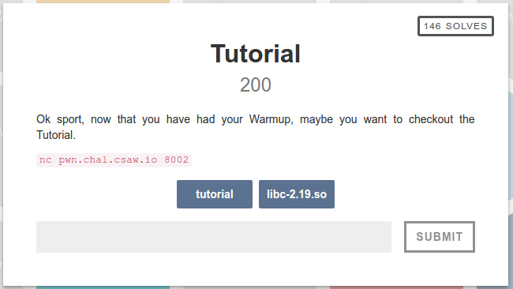
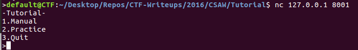
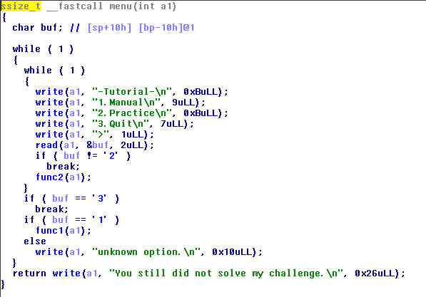
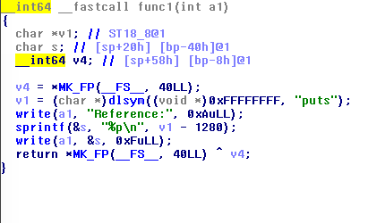
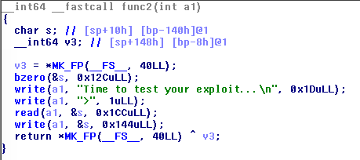
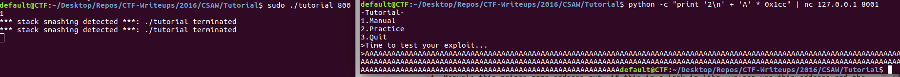
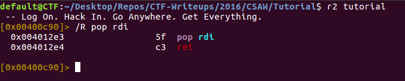
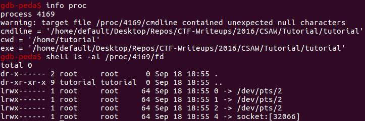
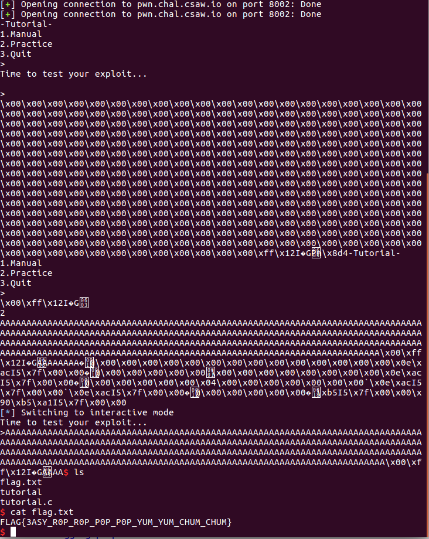

This challenge provides an executable and a libc.so file.

Running this file causes a segfault, so lets look at it in IDA:

The file expects us to pass an argument designating the port number to listen on.

running the program with argument 8000 will still have some errors: to get it working fully you have to fix the errors that it lists (making a user named tutorial, making a home directory for the user, etc)

Once this setup is done, we can run the program locally for testing.
I could only get the program to run as root (probably not the safest thing to do, but I didn't feel like fixing the permission errors I was getting)

running sudo ./tutorial 8001 in one terminal then nc 127.0.0.1 8001 in another terminal lets us connect to the service:

There are 3 menu options:

1. Manual: this prints some address out, if this is a leak in libc, we can use this address and the given libc to get the address of anything in libc

2. This prompts you to enter your exploit, this is probably where we should look for a vulnerability

3. Quit: quits the program

At this point, I decided to look at the 'menu' function from the binary in IDA:

We can see that func2 is called if '2' is input at the menu, and func1 is called if '1' is input.

Lets see what option 1 does:

Here we can see that the function gets the address of the symbol "puts" in the current process, and prints this address - 1280.

Since we now know the address of puts in memory, we can get around ASLR to find the address of anything in libc:
address of thing in process = leaked address + 1280 - offset of puts + offset of thing we're finding in libc

To find offsets of a symbol in libc, you can open the given libc file in ida; its address in ida is its offset.

Now lets look at func2:

This function has a clear buffer overflow: it reads 0x1cc bytes of input into a buffer at [bp - 140h]

The only thing in the way of a buffer overflow exploit is the stack canary:

Looking at the disassembly shows us that the stack canary is found at ebp - 8
In order to succesfully exploit the system, we need to find the stack canary's value and include it at the right place in our exploit so that it is not modified by our buffer overflow

Luckily for us, the stack canary is printed by the write() call at the end of the function. (It outputs 0x144 bytes starting at bp - 0x140, the canary is found at bp - 8)

So we can simply enter nothing as input to func 2, read the stack canary from the output, and then call func2 again with our real exploit.

The Exploit:
In order to exploit this vulnerability, we will need to use ROP.
We can get the address of system() using the leaked memory address and offsets from libc-2.19.so 
We can also get the address of the string "/bin/sh" found libc-2.19.so
If we can load "/bin/sh" into rdi, then return to system(), we can get a shell on the server.

The easiest way to get "/bin/sh" into rdi is to include its address into our input, then pop it into rdi using a rop gadget. To find gadgets for this exploit, I used radare2:

If we overwrite the return address (rbp + 8) with the address of this gadget, put the address of "/bin/sh" in rbp + 16, and put the address of system into rbp + 24, func2 will return to the gadget, pop
"/bin/sh" into rdi, then return into system, executing /bin/sh.

The exploit now looks like this:
"A" * (0x140 - 8) + stack canary + [8 bytes of filler] + pop_rdi_ret_gadget + bin_sh + system

Writing up this exploit spawns a shell from the service, but we can't interact with it. This is because system connects the input and output of /bin/sh to file descriptors 0 and 1 respectively, of the parent process. Since we are passing input and output through a different file descriptor (for the socket being used), we can't interact with the shell we launched.

In order to interact with the shell we create, we need to replace file descriptors 0 and 1 with the descriptor for the socket we're communicating through.

To do this, we must call close(0) and close(1) to close the file descriptors for stdin and stdout
We can then call dup(socket fd) twice to create file descriptors 0 and 1 that use our socket.

We can get the address of close and dup the same way we got the addresses of the other libc functions.

To find the socket being used, I launched the program in gdb, then looked at its open file descriptors in /proc/\<pid\>/fd/

To do this, simply set a breakpoint anywhere after the socket is created, and look at its file descriptors.

We can see from /proc/\<pid\>/fd that the socket has file descriptor 4.

Now our exploit looks like this:

(0x140 - 8) bytes of filler + stack_canary + 8 bytes of filler + pop_rdi_ret gadget + 0 + address of close + pop_rdi_ret gadget + 1 + address of close + pop_rdi_ret gadget + socket_fd number + address of dup + address of dup + pop_rdi_ret address + bin_sh address + system address

This will bypass the stack canary, call close(0), call close(1), call dup(4) twice, then call system("/bin/sh")

An example of the final exploit can be found in tutorial.py

And we're done!
Flag : FLAG{3ASY_R0P_R0P_P0P_P0P_YUM_YUM_CHUM_CHUM}

