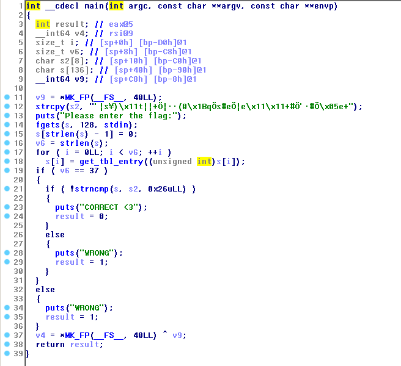
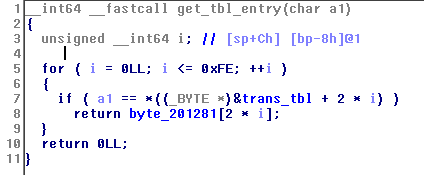
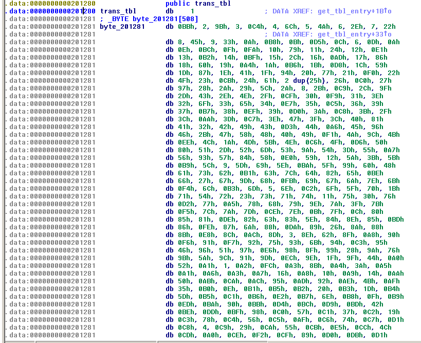
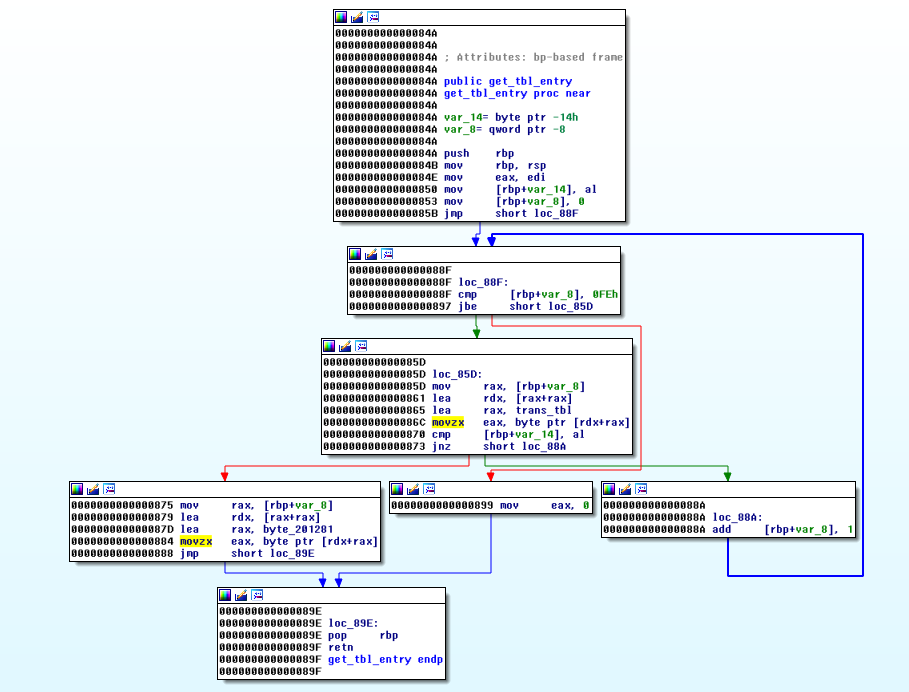
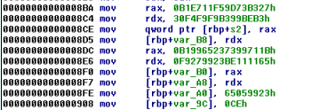

The challenge gives us a binary to analyze.

Here's the decompiled main method of the program in IDA:



From this, we can see that the program reads our input, and then replaces every character of the input with the result of a call to get_tbl_entry. After the input is done being transformed, it compares the result to some constant string defined in the program (the string stored in s2 in the decompiled code).

Lets see what the get_tbl_entry function is doing to our input:



From this code, we can see that every time the function is called, it loops through a table until it finds our input, and then returns the corresponding item from the byte_201281 array. Lets see how these tables are stored:



From this we can see that the byte_201281 array is the same table as trans_tbl, just offset by one. This means that every time a character of our input is found in the table, the function returns the next entry in the table. This can be easily reversed by simply copying the final string that our transformed input is compared against in main, and then doing the opposite of the table lookups on it (find each character of the final output, find it in the table, and return the value before it). 

Another way of doing this is by patching the program to invert the functionality of get_tbl_entry. If we change the code to instead find the entry in the byte_201281 array, and then return the element before it in the table, we can simply enter the final string that our transformed input is compared against, and the program will decode it for us.



From the disassembly, we can see that the addresses of trans_tbl and the byte_201281 array are loaded during instructions at addresses 0x865 and 0x87d respectively. If we patch the instruction that loads trans_tbl to instead load trans_tbl + 1, and the instruction that loads byte_201281 to instead load byte_201281 - 1, the functionality of get_tbl_entry will be reversed.

To do this, I patched the program in radare2.

```
default@CTF:~/Desktop/Repos/CTF_WRITEUPS_NEW/CTF-Writeups/2017/CSAW/tableEz$ cp tablez tablez_patched
default@CTF:~/Desktop/Repos/CTF_WRITEUPS_NEW/CTF-Writeups/2017/CSAW/tableEz$ r2 -Aw tablez_patched
[x] Analyze all flags starting with sym. and entry0 (aa)
[x] Analyze len bytes of instructions for references (aar)
[x] Analyze function calls (aac)
[ ] [*] Use -AA or aaaa to perform additional experimental analysis.
[x] Constructing a function name for fcn.* and sym.func.* functions (aan))
 -- Using radare2 to generate intelligence ...
[0x00000740]> 0x865
[0x00000865]> pdf
/ (fcn) sym.get_tbl_entry 86
|           ; arg int arg_2h @ rbp+0x2
|           ; arg int arg_feh @ rbp+0xfe
|           ; var int local_8h @ rbp-0x8
|           ; var int local_14h @ rbp-0x14
|           ; CALL XREF from 0x0000098f (sym.main)
|           0x0000084a      55             push rbp
|           0x0000084b      4889e5         mov rbp, rsp
|           0x0000084e      89f8           mov eax, edi
|           0x00000850      8845ec         mov byte [rbp - local_14h], al
|           0x00000853      48c745f80000.  mov qword [rbp - local_8h], 0
|       ,=< 0x0000085b      eb32           jmp 0x88f
|       |   ; JMP XREF from 0x00000897 (sym.get_tbl_entry)
|      .--> 0x0000085d      488b45f8       mov rax, qword [rbp - local_8h]
|      ||   0x00000861      488d1400       lea rdx, [rax + rax]
|      ||   0x00000865      488d05140a20.  lea rax, [rip + 0x200a14]   ; 0x201280 ; obj.trans_tbl ; obj.trans_tbl
|      ||   0x0000086c      0fb60402       movzx eax, byte [rdx + rax]
|      ||   0x00000870      3845ec         cmp byte [rbp - local_14h], al ; [0x2:1]=76
|     ,===< 0x00000873      7515           jne 0x88a
|     |||   0x00000875      488b45f8       mov rax, qword [rbp - local_8h]
|     |||   0x00000879      488d1400       lea rdx, [rax + rax]
|     |||   0x0000087d      488d05fd0920.  lea rax, [rip + 0x2009fd]   ; 0x201281
|     |||   0x00000884      0fb60402       movzx eax, byte [rdx + rax]
|    ,====< 0x00000888      eb14           jmp 0x89e
|    ||||   ; JMP XREF from 0x00000873 (sym.get_tbl_entry)
|    |`---> 0x0000088a      488345f801     add qword [rbp - local_8h], 1
|    | ||   ; JMP XREF from 0x0000085b (sym.get_tbl_entry)
|    | |`-> 0x0000088f      48817df8fe00.  cmp qword [rbp - local_8h], 0xfe ; [0xfe:8]=0x2010000000
|    | `==< 0x00000897      76c4           jbe 0x85d
|    |      0x00000899      b800000000     mov eax, 0
|    |      ; JMP XREF from 0x00000888 (sym.get_tbl_entry)
|    `----> 0x0000089e      5d             pop rbp
\           0x0000089f      c3             ret
[0x00000865]> 
```

We can see that the existing instruction is lea rax, [rip + 0x200a14]. So to patch this, we should instead load [rip + 0x200a15], which is 1 byte higher in the address space. For some reason r2 uses rip-based addressing by default when writing instructions, we we can simply write the instruction lea rax, [0x200a15]. We can also do the same at address 0x87d by changing the instruction to lea rax, [0x2009fc]. 

```
[0x00000865]> wa lea rax, [0x200a15]
Written 7 bytes (lea rax, [0x200a15]) = wx 488d05150a2000
[0x00000865]> 0x87d
[0x0000087d]> wa lea rax, [0x2009fc]
Written 7 bytes (lea rax, [0x2009fc]) = wx 488d05fc092000
```

Now we need to get the string that we want to decode back into the flag. By looking at the disassembly, we can see the area in the code where the string is being loaded into the buffer:



Since the values are little endian, we can just copy the byte contents in reverse to get the string. I wrote the string to a file to make it easier to use as input to the program:

```bash
echo $'\x27\xb3\x73\x9d\xf5\x11\xe7\xb1\xb3\xbe\x99\xb3\xf9\xf9\xf4\x30\x1b\x71\x99\x73\x23\x65\x99\xb1\x65\x11\x11\xbe\x23\x99\x27\xf9\x23\x99\x05\x65\xce' > test_input.txt
```

I then debugged the program with GDB to set a breakpoint on the code after our string is decoded, so that I can read the result out of memory. By looking at the disassembly, we can see that, after the string gets decoded, the length will be checked at address 0x9c1, so I decided to set a breakpoint there to read the decoded string.


GDB rebased the program (loading the program at address 0x555555554000), so I found where main was located to find out how much I should offset the address 0x9c1 by to get its new location.

```
default@CTF:~/Desktop/Repos/CTF_WRITEUPS_NEW/CTF-Writeups/2017/CSAW/tableEz$ gdb tablez_patched 

gdb-peda$ r
Starting program: /home/default/Desktop/Repos/CTF_WRITEUPS_NEW/CTF-Writeups/2017/CSAW/tableEz/tablez_patched 
Please enter the flag:
^C
Program received signal SIGINT, Interrupt.

gdb-peda$ info addr main
Symbol "main" is at 0x5555555548a0 in a file compiled without debugging.

gdb-peda$ b *0x5555555549c1
Breakpoint 1 at 0x5555555549c1

gdb-peda$ r  < test_input.txt
Starting program: /home/default/Desktop/Repos/CTF_WRITEUPS_NEW/CTF-Writeups/2017/CSAW/tableEz/tablez_patched < test_input.txt
Please enter the flag:
[----------------------------------registers-----------------------------------]
RAX: 0x25 ('%')
RBX: 0x0 
RCX: 0x7d ('}')
RDX: 0x7fffffffd800 ("flag{t4ble_l00kups_ar3_b3tter_f0r_m3}")
RSI: 0x555555756446 --> 0x0 
RDI: 0xffffffce 
RBP: 0x7fffffffd890 --> 0x555555554a40 (<__libc_csu_init>:  push   r15)
RSP: 0x7fffffffd7c0 --> 0x25 ('%')
RIP: 0x5555555549c1 (<main+289>:    cmp    QWORD PTR [rbp-0xc8],0x25)
R8 : 0xc0e0 
R9 : 0x0 
R10: 0x309 
R11: 0x7ffff7a98720 (<strlen>:  pxor   xmm0,xmm0)
R12: 0x555555554740 (<_start>:  xor    ebp,ebp)
R13: 0x7fffffffd970 --> 0x1 
R14: 0x0 
R15: 0x0
EFLAGS: 0x246 (carry PARITY adjust ZERO sign trap INTERRUPT direction overflow)
[-------------------------------------code-------------------------------------]
   0x5555555549b1 <main+273>:   mov    rax,QWORD PTR [rbp-0xd0]
   0x5555555549b8 <main+280>:   cmp    rax,QWORD PTR [rbp-0xc8]
   0x5555555549bf <main+287>:   jb     0x555555554976 <main+214>
=> 0x5555555549c1 <main+289>:   cmp    QWORD PTR [rbp-0xc8],0x25
   0x5555555549c9 <main+297>:   je     0x5555555549de <main+318>
   0x5555555549cb <main+299>:   lea    rdi,[rip+0x109]        # 0x555555554adb
   0x5555555549d2 <main+306>:   call   0x555555554700 <puts@plt>
   0x5555555549d7 <main+311>:   mov    eax,0x1
[------------------------------------stack-------------------------------------]
0000| 0x7fffffffd7c0 --> 0x25 ('%')
0008| 0x7fffffffd7c8 --> 0x25 ('%')
0016| 0x7fffffffd7d0 --> 0xb1e711f59d73b327 
0024| 0x7fffffffd7d8 --> 0x30f4f9f9b399beb3 
0032| 0x7fffffffd7e0 --> 0xb19965237399711b 
0040| 0x7fffffffd7e8 --> 0xf9279923be111165 
0048| 0x7fffffffd7f0 --> 0xce65059923 
0056| 0x7fffffffd7f8 --> 0x0 
[------------------------------------------------------------------------------]
Legend: code, data, rodata, value

Breakpoint 1, 0x00005555555549c1 in main ()
gdb-peda$ 
```
Then we can see that the flag has been decoded (in this case it happens to be stored in rdx).