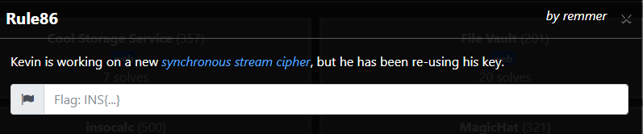

# Getting Started:

We're given a link to an archive containing 4 files: 

* hint.gif.enc
* rule86.txt
* rule86.txt.enc
* super_cipher.py.enc

Each of these files is included in this the `sample_files` folder in this repo: [Link](./sample_files/)

The only readable file is rule86.txt, but it just contains nonsense.

As stated in the challenge description, the provided `*.enc` files were encrypted with a synchronous stream cipher.


# Stream Ciphers

In a synchronous stream cipher, a key stream is generated with a pseudorandom number generator, and the generated stream of bytes is xored with the message to get the ciphertext. 

In this scheme, the PRNG is parameterized by a secret key.

Since we know that `ciphertext = keystream ^ message`, and we know a `ciphertext` and `message` pair (`rule86.txt` and `rule86.txt.enc`), we can calculate part of the keystream by calculating `keystream = ciphertext ^ message`.

One we know part of the keystream, we can decrypt other ciphertexts by just xoring them with the keystream.

# Partial decryption

At this point, we can only decrypt as many bytes of a ciphertext as we have bytes of the keystream (aka the size of `rule86.txt`). Because of this, we can't fully decrypt any of the other files, as they're all too large.

As a start, we decrypted the `super_cipher.py.enc` file to see some of the code that was used for the cipher.

Here is the partially decrypted code:
```python
#!/usr/bin/env python3

import argparse
import sys

parser = argparse.ArgumentParser()
parser.add_argument("key")
args = parser.parse_args()

RULE = [86 >> i & 1 for i in range(8)]
N_BYTES = 32
N = 8 * N_BYTES

def next(x):
  x = (x & 1) << N+1 | x << 1 | x >> N-1
  y = 0
  for i in range(N):
    y |= RULE[(x >> i) & 7] << i
  return y

# Bootstrap the PNRG
keystream = int.from_bytes(args.key.encode(),'little')
for i in range(N//2):
  keystream = next(keystream)

# Encrypt / decrypt stdin to stdout
plainte
```

From this code, we know how how the keystream is generated (just repeatedly calling `next` on the previous keystream block), and can thus generate a keystream of whatever length we want using the partial keystream that we recovered:

```python

#read the sample data given to us
txt = open("./sample_files/rule86.txt", "rb").read()
enc = open("./sample_files/rule86.txt.enc", "rb").read()
hint = open("./sample_files/hint.gif.enc", "rb").read()
py_file = open("./sample_files/super_cipher.py.enc", "rb").read()

#xors two byte arrays
def xor(bytes1, bytes2):
    return bytearray([(a ^ b) for (a, b) in zip(bytes1, bytes2)])

#gets the first N_BYTES of the keystream that was used to encrypt rule86.txt.enc
def get_base_keystream():
    return xor(txt, enc)[0:N_BYTES]

#gets the base keystream that was used, and generates the whole `length` byte keystream that can be used to decrypt
def generate_stream(length):
    keystream = get_base_keystream()
    curr_int = int.from_bytes(keystream, 'little')
    for i in range(ceil(length/N_BYTES) - 1):
        curr_int = next(curr_int)
        keystream += curr_int.to_bytes(N_BYTES, 'little')
    return keystream

#decrypts an array of bytes
def decrypt(input_bytes):
    length = len(input_bytes)
    keystream = generate_stream(length)
    return xor(input_bytes, keystream)

```

Using this, we were able to fully decrypt each of the encrypted files.

# Now we're done right?

At this point, we looked at the decrypted files, and were disappointed to find that the `hint.gif` did not contain the flag (and super_cipher.py didn't contain any more useful info):


From the hint, we could see that the key that was input to bootstrap the "prg" is a flag for the challenge, and so we need to reverse the prg, and walk our way back through the keystream to get what the input key was.

# Reversing the "prg"

From the decrypted code, we could see that the `next` function does the following:

* Takes in a 256 bit input x
* Computes a 257 bit x' such that the first bit of x' is the 256th bit of x, the 257th bit of x' is the 1st bit of x and the remaining 255 bits of x' are x' left shifted by 1.
* Computes a value y, where each bit of y is determined by looking up 3 bits of x' in a table of 0's and 1's.

So in order to reverse this, we did the following:
* For the first bit of a 256 bit input y, determine what possible 3-bit codes of x' could have resulted in that bit of y and store them as possible decodings of y.
* Walk through y one bit at a time, and update the potential values of x' that could have resulted in what we've seen so far in y.
* At the end, look at all of our possibilities for x' and check that they match the following conditions:
	* The 257th bit of x' == the 2nd to last bit of x' (both were set to be the first bit of x in `next`)
	* The 256th bit of x' == the last bit of x' (both were set to be the 256th bit of x in `next`)
* After recovering the 1 valid possibility for x', undo the bit shifts that were done in `next` to recover the original x.

Here's the code that was written to solve this:
```python
#given in super_cipher.py
RULE = [(86 >> i) & 1 for i in range(8)]
N_BYTES = 32
N = 8 * N_BYTES

# in y = next(x), each 3 bits of x determines 1 bit of y
# use this dictionary to store this relation for reversing this function
dct = {
    #y      x
    "0" : ["000", "011", "101", "111"],
    "1" : ["001", "010", "100", "110"]
}

#takes in an int value of keystream, reverses the "prg" to get the value that came before it
def prev(y):
    #turn to bit string of 256 bits
    y = "{0:b}".format(y)
    y = y.zfill(N)

    #the last bit can be decoded as any of the 4 values of x that could have set that bit
    possibilities = dct[y[-1]]
    #loop in reverse to get all possible values of x that could have created this y
    for bit in reversed(y[:-1]):
        new_possibilities = []
        candidates = dct[bit]
        for candidate in candidates:
            for possibility in possibilities:
                #if the last 2 bits of the candidate match the first two bits of an existing possibility,
                #we can just append the first bit of the candidate to the possibility
                if candidate[1:] == possibility[:2]:
                    new_possibilities += [candidate[0] + possibility]
        possibilities = new_possibilities

    #Do some more checks to see which possibilities are actually valid
    real = []
    for possibility in possibilities:
        #the `next` function takes an input x, and turns it into x' such that the last bit of x' = the first bit of x, and the first bit of x' = the last bit of x
        #so check that the values of possibility are valid x' values in this way.
        if possibility[0] == possibility[-2]:
            if possibility[1] == possibility[-1]:
                real += [possibility]
    if len(real) != 1:
        print("there was an issue :(")
        print(len(real))
        sys.exit();

    #convert back to an int
    x = int(real[0], 2)

    #reverse the bit operations done in `next` 
    #(move the first bit to be the N'th bit, shift the rest of the value to the right by 1)
    x = ((x >> 1) & ((2**N) - 1)) | ((x & 1) << (N - 1))
    return x

```

Once we could reverse the `next` function, we took the first keystream block used to encrypt, and reversed the bootstrapping loop to get back the original key:

```python
#we can get part of the key stream by just Xoring together a plaintext and a ciphertext
# C = (M ^ K), so C ^ M = K, which lets us recover the keystream.
partial_keystream = xor(txt, enc)

#the first value of `keystream` used to encrypt the ciphertexts we've been given (the first 256 bits of the partial keystream)
base_key = int.from_bytes(partial_keystream[0:N_BYTES], 'little')

#use prev to reverse the key stream generation to get the original key
curr = base_key
for i in range(N//2):
    curr = prev(curr)
print(curr.to_bytes(N_BYTES, 'little'))

```

And this outputs the key/flag:


`INS{Rule86_is_W0lfr4m_Cha0s}`

The full solution code can be found here: [Link](./sol.py)
